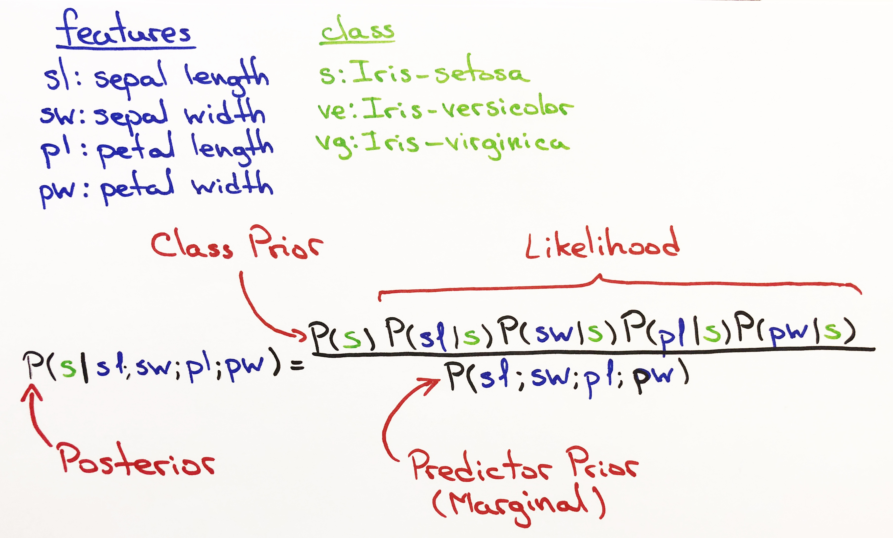
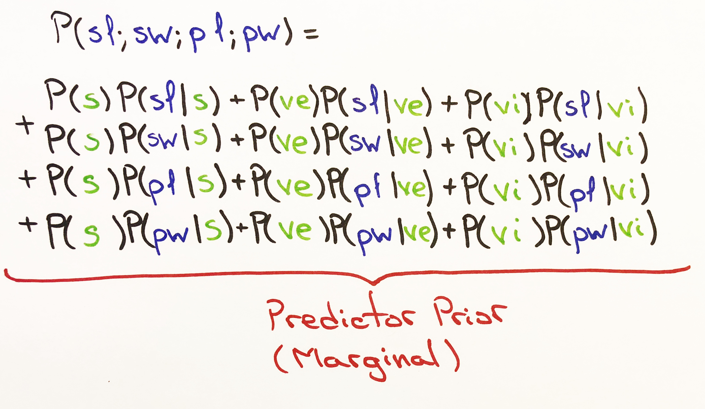

# Gauss Naive Bayes In Python

Building a Naive Bayes classifier using Python.

The complete code for the below tutotial could be found in [nb_tutorial.py](https://github.com/odubno/naive_bayes/blob/master/nb_tutorial.py)


# Table of Contents
  - [Overview](#overview)
    - [Iris Data Set](#iris-data-set)
    - [Bayes Theorem](#bayes-theorem)
    - [Normal Probability Density Function](#normal-pdf)
    - [Joint Probability Density Function](#joint-pdf)
  - [Prepare Dare](#prepare-data)
    - [Prerequisites](#prerequisites)
    - [Load CSV](#load-csv)
    - [Split Data](#split-data)
    - [Group Data](#group-data)
  - [Summarize Data](#summarize-data)
    - [Mean](#mean)
    - [Standard Deviation](#standard-deviation)
    - [Summary](#summary)
  - [Build Model](#build-model)
    - [Prior Probability](#prior-probability)
    - [Train](#train)
    - [Normal Probability](#normal-probability)
    - [Marginal Probability](#marginal-probability)
    - [Posterior Probability](#posterior-probability)
  - [Test Model](#test-model)
    - [Get Prediction](#get-prediction)
    - [Predict](#predict)
    - [Accuracy](#accuracy)
  - [Break down](#break-down)
  - [Authors](#authors)
  - [Acknowledgments](#acknowledgments)
      
# Overview 
We will be using Naive Bayes and the Gaussian Distribution (Normal Distribution) to build a classifier in Python from scratch.

The Gauss Naive Bayes Classifier will beable to run on four classic data sets:

* [iris](http://archive.ics.uci.edu/ml/machine-learning-databases/iris/iris.data)
* [diabetes](https://archive.ics.uci.edu/ml/machine-learning-databases/pima-indians-diabetes/pima-indians-diabetes.data)
* [redwine](http://archive.ics.ucimachine-learning-databases/wine-quality/winequality-red.csv)
* [adult](http://archive.ics.uci.edu/ml/machine-learning-databases/adult/adult.data)


Here we'll be working with just the [iris](http://archive.ics.uci.edu/ml/machine-learning-databases/iris/iris.data) data set.

The logic for the code to work on all four data sets is in [gauss_nb.py](https://github.com/odubno/naive_bayes/blob/master/gauss_nb.py).
This tutotial will follow the logic in [nb_tutorial.py](https://github.com/odubno/naive_bayes/blob/master/nb_tutorial.py).

## Iris Data Set:

The Iris data set is a classic and is widely used when explaining classification models. 
The data set has 4 independent variables and 1 dependent variable that has 3 different classes.

The first 4 columns are the independent variables (features).                                      
The 5th column is the dependent variable (class).

1. *sepal length* (cm)
2. *sepal width* (cm) 
3. *petal length* (cm) 
4. *petal width* (cm) 
5. classes: 
    * *Iris Setosa*, 
    * *Iris Versicolour*
    * *Iris Virginica*

- 5 row sample from the Iris data
- The first 4 columns represent the **features** (*sepal length*, *sepal width*, *petal length*, *petal width*)
- The last column represents the **class** for each row. (*Setosa*, *Versicolour*, *Virginica*)

| sepal length  | sepal width | petal length | petal width | class |
| :-----------: |:-----------:| :----------: | :----------:| :----:|
| 5.1 | 3.5 | 1.4 | 0.2| Iris-setosa | 
| 4.9 | 3.0 | 1.4 | 0.2| Iris-setosa |
| 7.0 | 3.2 | 4.7 | 1.4| Iris-versicolor |
| 6.3 | 2.8 | 5.1 | 1.5| Iris-virginica |
| 6.4 | 3.2 | 4.5 | 1.5| Iris-versicolor |

## Bayes Theorem:


**Class Prior Probability:** 
* This is our Prior Belief

**Likelihood:**
* We are using the [Normal Distribution (Gauss)](#normal-pdf) to calculate this. Hence, the name Gauss Naive Bayes.

**Predictor Prior Probability:**
* Marginal probability of how probable the new evidence is under all possible hypothesis. Most Naive Bayes Classifiers do not calculate this. The results do not change or change very little. Though we do calculate it here.


## Normal PDF Formula:


See [Normal Distribution (Wikipedia)](https://en.wikipedia.org/wiki/Normal_distribution) definition.

The Normal Distribution will help determine the likelihood of a *class* occuring for each feature. In other words for each column of our dataset, the Normal Distribution will calculate the likelihood of that *class* occuring. 

## Joint PDF Formula:


See [Joint PDF (Wikipedia )](https://en.wikipedia.org/wiki/Joint_probability_distribution) definition.

The Joint PDF is the product of all PDFs. In our case, the product of all Normal Distribution PDFs. Multiplying all of the PDFs gives us the likelihood.


# Prepare Data

Building the Naive Bayes Classifier. 

1. [Skeleton](#skeleton)
2. [Load CSV](#load-csv)
3. [Split Data](#split-data)
4. [Group Data](#group-data)


## Prerequisites


Every function is created from scratch.
However, instead of having to download the data, we're using a quick api call to get the csv.

```
$ pip install requests
```

## Skeleton

Create the skeleton: 
- import the necessary libraries and create the class.

```python
# -*- coding: utf-8 -*-
from collections import defaultdict
from math import pi
from math import e
import requests
import random
import csv
import re

class GaussNB:

    def __init__(self):
        pass
        
        
def main():
    print "Here we will handle class methods."
    
    
if __name__ == '__main__':
    main()
```
Execute in terminal:
```
$ python nb_tutorial.py
```


###### Output:
```
Here we will handle class methods.
```

## Load CSV

Writing the method to read in the raw data.


```python
class GaussNB:

    def __init__(self):
        pass
        
    def load_csv(self, data, header=False):
        """
        :param data: raw comma seperated file
        :param header: remove header if it exists
        :return:
        Load and convert each string of data into a float
        """
        lines = csv.reader(data.splitlines())
        dataset = list(lines)
        if header:
            # remove header
            dataset = dataset[1:]
        for i in range(len(dataset)):
            dataset[i] = [float(x) if re.search('\d', x) else x for x in dataset[i]]
        return dataset
        
def main():
    nb = GaussNB()
    url = 'http://archive.ics.uci.edu/ml/machine-learning-databases/iris/iris.data'
    data = requests.get(url).content
    data = nb.load_csv(data, header=True)
    print data[:3] # first 3 rows
    
    
if __name__ == '__main__':
    main()
```

###### Output:
```
[[4.9, 3.0, 1.4, 0.2, 'Iris-setosa'], [4.7, 3.2, 1.3, 0.2, 'Iris-setosa'], [4.6, 3.1, 1.5, 0.2, 'Iris-setosa']]
```

## Split Data
Splitting data into train and test set.
The weight will determine how much of the data will be training.

```python
class GaussNB:
    .
    .
    .
    def split_data(self, data, weight):
        """
        :param data:
        :param weight: indicates the percentage of rows that'll be used for training
        :return:
        Randomly selects rows for training according to the weight and uses the rest of the rows for testing.
        """
        train_size = int(len(data) * weight)
        train_set = []
        for i in range(train_size):
            index = random.randrange(len(data))
            train_set.append(data[index])
            data.pop(index)
        return [train_set, data]


def main():
    nb = GaussNB()
    url = 'http://archive.ics.uci.edu/ml/machine-learning-databases/iris/iris.data'
    data = requests.get(url).content
    data = nb.load_csv(data, header=True)
    train_list, test_list = nb.split_data(data, weight=.67)
    print "Using %s rows for training and %s rows for testing" % (len(train_list), len(test_list))

if __name__ == '__main__':
    main()
```


## Group Data

Grouping data by class. This method will map each class to it's respective rows of data.

e.g. (This is just a sample. Using the [table](#iris-data-set) from above.)
```python
{
       'Iris-virginica': [
        [6.3, 2.8, 5.1, 1.5],
    ], 'Iris-setosa': [
        [5.1, 3.5, 1.4, 0.2],
        [4.9, 3.0, 1.4, 0.2],
    ], 'Iris-versicolor': [
        [7.0, 3.2, 4.7, 1.4],
        [6.4, 3.2, 4.5, 1.5],
    ]
}
```

```python
class GaussNB:
    .
    .
    .
    def group_by_class(self, data, target):
        """
        :param data: Training set. Lists of events (rows) in a list
        :param target: Index for the target column. Usually the last index in the list
        :return:
        Mapping each target to a list of it's features
        """
        target_map = defaultdict(list)
        for index in range(len(data)):
            features = data[index]
            if not features:
                continue
            x = features[target]
            target_map[x].append(features[:-1])  # designating the last column as the class column
        print 'Identified %s different target classes: %s' % (len(target_map.keys()), target_map.keys())
        return dict(target_map)

def main():
    nb = GaussNB()
    url = 'http://archive.ics.uci.edu/ml/machine-learning-databases/iris/iris.data'
    data = requests.get(url).content
    data = nb.load_csv(data, header=True)
    train_list, test_list = nb.split_data(data, weight=.67)
    print "Using %s rows for training and %s rows for testing" % (len(train_list), len(test_list))
    group = nb.group_by_class(data, -1)
    print "Grouped into %s classes: %s" % (len(group.keys()), group.keys())

if __name__ == '__main__':
    main()
```

###### Output:
`Grouped into 3 classes: ['Iris-virginica', 'Iris-setosa', 'Iris-versicolor']`

# Summarize Data

Preparing data for modeling:
1. [Mean](#mean)
2. [Standard Deviation](#standard-deviation)
3. [Summary](#sumamry)

## Mean

```python
class GaussNB:
    .
    . 
    . 
    def mean(self, numbers):
        """
        :param numbers: list of numbers
        :return: 
        """
        result = sum(numbers) / float(len(numbers))
        return result

def main():
    nb = GaussNB()
    print "Mean: %s" % nb.mean([5.9, 3.0, 5.1, 1.8])

if __name__ == '__main__':
    main()
```
###### Output:
```
Mean: 3.95
```

## Standard Deviation
Calculating the spread of data. Later used to calculate the Normal Distribution.

```python
class GaussNB:
    . 
    . 
    . 
    def stdev(self, numbers):
        """
        :param numbers: list of numbers
        :return:
        Calculate the standard deviation for a list of numbers.
        """
        avg = self.mean(numbers)
        squared_diff_list = []
        for num in numbers:
            squared_diff = (num - avg) ** 2
            squared_diff_list.append(squared_diff)
        squared_diff_sum = sum(squared_diff_list)
        sample_n = float(len(numbers) - 1)
        var = squared_diff_sum / sample_n
        return var ** .5

def main():
    nb = GaussNB()
    print "Standard Deviation: %s" % nb.stdev([5.9, 3.0, 5.1, 1.8])

if __name__ == '__main__':
    main()
```
###### Output:
```
Standard Deviation: 1.88414436814
```

## Summary
Returns the (mean, standard deviation) combination for each feature column of the data set.

```python
class GaussNB:
    . 
    . 
    . 
    def summarize(self, data):
        """
        :param data: lists of events (rows) in a list
        :return:
        Use zip to line up each feature into a single column across multiple lists.
        yield the mean and the stdev for each feature
        """
        for attributes in zip(*data):
            yield {
                'stdev': self.stdev(attributes),
                'mean': self.mean(attributes)
            }

def main():
    nb = GaussNB()
    data = [
        [5.9, 3.0, 5.1, 1.8], 
        [5.1, 3.5, 1.4, 0.2]
    ]
    print "Feature Summary: %s" % [i for i in nb.summarize(data)]

if __name__ == '__main__':
    main()
```
###### Output:
```
Feature Summary: 
[
    {'mean': 5.5, 'stdev': 0.5656854249492386}, # sepal length 
    {'mean': 3.25, 'stdev': 0.3535533905932738}, # sepal width
    {'mean': 3.25, 'stdev': 2.6162950903902256}, # petal length
    {'mean': 1.0, 'stdev': 1.1313708498984762} # petal width
]
```

# Build Model

Building methods for calculating [Bayes Theorem](#bayes-theorem):
1. [Prior Probability](#prior-probability)
2. [Normal Probability](#normal-probability)
3. [Marginal Probability](#marginal-probability)
4. [Posterior Probability](#posterior-probability)

#### Prior Probability
Calculating the prior probability for each class.
Prior probability is simply the probability of each class occurring.

```python
class GaussNB:
    . 
    . 
    . 
    def prior_prob(self, group, target, data):
        """
        :return:
        The probability of each target class
        """
        total = float(len(data))
        result = len(group[target]) / total
        return result

def main():
    nb = GaussNB()
    url = 'http://archive.ics.uci.edu/ml/machine-learning-databases/iris/iris.data'
    data = requests.get(url).content
    data = nb.load_csv(data, header=True)
    train_list, test_list = nb.split_data(data, weight=.67)
    print "Using %s rows for training and %s rows for testing" % (len(train_list), len(test_list))
    group = nb.group_by_class(data, -1)  # designating the last column as the class column
    print "Grouped into %s classes: %s" % (len(group.keys()), group.keys())
    for target_class in ['Iris-virginica', 'Iris-setosa', 'Iris-versicolor']:
        prior_prob = nb.prior_prob(group, target_class, data)
        print 'P(%s): %s' % (target_class, prior_prob)

if __name__ == '__main__':
    main()
```
###### Output:
```
Using 100 rows for training and 50 rows for testing
Grouped into 3 classes: ['Iris-virginica', 'Iris-setosa', 'Iris-versicolor']
P(Iris-virginica): 0.38
P(Iris-setosa): 0.3
P(Iris-versicolor): 0.32
```

## Train
Tying the previous methods together to determine the Prior Probability for each class and the (mean, standard deviation) combination for each feature of each class.
```python
class GaussNB:
    . 
    . 
    . 
    def train(self, train_list, target):
        """
        :param data:
        :param target: target class
        :return:
        For each target:
            1. yield prior: the probability of each class. P(class) eg P(Iris-virginica)
            2. yield summary: list of {'mean': 0.0, 'stdev': 0.0}
        """
        group = self.group_by_class(train_list, target)
        self.summaries = {}
        for target, features in group.iteritems():
            self.summaries[target] = {
                'prior': self.prior_prob(group, target, train_list),
                'summary': [i for i in self.summarize(features)],
            }
        return self.summaries

def main():
    nb = GaussNB()
    url = 'http://archive.ics.uci.edu/ml/machine-learning-databases/iris/iris.data'
    data = requests.get(url).content
    data = nb.load_csv(data, header=True)
    train_list, test_list = nb.split_data(data, weight=.67)
    print "Using %s rows for training and %s rows for testing" % (len(train_list), len(test_list))
    group = nb.group_by_class(data, -1)  # designating the last column as the class column
    print "Grouped into %s classes: %s" % (len(group.keys()), group.keys())
    print nb.train(train_list, -1)

if __name__ == '__main__':
    main()
```
###### Output:
```
Using 100 rows for training and 50 rows for testing
Grouped into 3 classes: ['Iris-virginica', 'Iris-setosa', 'Iris-versicolor']
{'Iris-setosa': {'prior': 0.3,
  'summary': [{'mean': 4.980000000000001, 'stdev': 0.34680810554104063}, # sepal length 
   {'mean': 3.406666666666667, 'stdev': 0.3016430104397023}, # sepal width
   {'mean': 1.496666666666667, 'stdev': 0.20254132542705236}, # petal length
   {'mean': 0.24333333333333343, 'stdev': 0.12228664272317624}]}, # petal width
 'Iris-versicolor': {'prior': 0.31,
  'summary': [{'mean': 5.96774193548387, 'stdev': 0.4430102307127106},
   {'mean': 2.7903225806451615, 'stdev': 0.28560443356698495},
   {'mean': 4.303225806451613, 'stdev': 0.41990782398659987},
   {'mean': 1.3451612903225807, 'stdev': 0.17289439874755796}]},
 'Iris-virginica': {'prior': 0.39,
  'summary': [{'mean': 6.679487179487178, 'stdev': 0.585877428882027},
   {'mean': 3.002564102564103, 'stdev': 0.34602036712733625},
   {'mean': 5.643589743589742, 'stdev': 0.5215336048086158},
   {'mean': 2.0487179487179477, 'stdev': 0.2927831916298213}]}}

```

## Normal Probability


The Normal Distribution will determine the likelihood of each feature for the test set. Here we're using the [normal pdf formula](#normal-pdf-formula) mentioned above.

E.g.

As a quick example, below, we're using the Normal Distribution to determine the likelihood that 5 will occur given the mean of 4.98 and the standard deviation of 0.35.

FYI, we're "testing" 5 as the *sepal width* feature against **Iris-setosa** class: {'mean': 4.980000000000001, 'stdev': 0.34680810554104063} of the sepal width.


```python
class GaussNB:
    . 
    . 
    .
    def normal_pdf(self, x, mean, stdev):
        """
        :param x: a variable
        :param mean: µ - the expected value or average from M samples
        :param stdev: σ - standard deviation
        :return: Gaussian (Normal) Density function.
        N(x; µ, σ) = (1 / 2πσ) * (e ^ (x–µ)^2/-2σ^2
        """
        variance = stdev ** 2
        exp_squared_diff = (x - mean) ** 2
        exp_power = -exp_squared_diff / (2 * variance)
        exponent = e ** exp_power
        denominator = ((2 * pi) ** .5) * stdev
        pdf = exponent / denominator
        return pdf

def main():
    nb = GaussNB()
    normal_pdf = nb.normal_pdf(5, 4.98, 0.35)
    print normal_pdf

if __name__ == '__main__':
    main()
```
###### Output:
```
1.13797564994
```

## Marginal Probability


P(features) is referenced from [Bayes Theorem](#bayes-theorem).

Below we break down Bayes Theorem further, and expand on calculating the Marginal Probability only using the **Iris-setosa** class.
This is to be repeated for each class when running the prediction. The class with the highest posterior probability is the predicted class.



The marginal probability is calculated using sum of the product of Prior Probability and Normal Probability.


The Marginal Probability is determined using all 3 classes and the Normal Probability of their features.
The Marginal value, a single value, will be the same across all classes for each test. 
We could think of the Marginal Probability as the total probability of all 3 classes occurring given the Normal Probability of each class.
Thus, the Marginal value will be the same across all classes.

Reminder, to predict the class, we're looking for the **highest** [Posterior Probability](#bayes-theorem) from among all possible classes. 
Dividing by the same value will not improve the accuracy of predicting the correct class.

For the purposes of sticking to the true [Bayes Theorem](#bayes-theorem), we'll use it here.

```python
class GaussNB:
    . 
    . 
    . 
    def marginal_pdf(self, pdfs):
        """
        :param pdfs: list of probability densities for each feature
        :return:
        Marginal Probability Density Function (Predictor Prior Probability)
        Summing up the product of P(class) prior probability and the probability density of each feature P(feature | class)

        marginal pdf =
          P(setosa) * P(sepal length | setosa) + P(versicolour) * P(sepal length | versicolour) + P(virginica) * P(sepal length | virginica)
        + P(setosa) * P(sepal width | setosa) + P(versicolour) * P(sepal width | versicolour) + P(virginica) * P(sepal width | virginica)
        + P(setosa) * P(petal length | setosa) + P(versicolour) * P(petal length | versicolour) + P(virginica) * P(petal length | virginica)
        + P(setosa) * P(petal width | setosa) + P(versicolour) * P(petal width | versicolour) + P(virginica) * P(petal width | virginica)
        """
        predictors = []
        for target, features in self.summaries.iteritems():
            prior = features['pr ior']
            for index in range(len(pdfs)):
                normal_pdf = pdfs[index]
                predictors.append(prior * normal_pdf)
        marginal_pdf = sum(predictors)
        return marginal_pdf

def main():
    nb = GaussNB()
    url = 'http://archive.ics.uci.edu/ml/machine-learning-databases/iris/iris.data'
    data = requests.get(url).content
    data = nb.load_csv(data, header=True)
    train_list, test_list = nb.split_data(data, weight=.67)
    print "Using %s rows for training and %s rows for testing" % (len(train_list), len(test_list))
    group = nb.group_by_class(data, -1)  # designating the last column as the class column
    print "Grouped into %s classes: %s" % (len(group.keys()), group.keys())
    nb.train(train_list, -1)
    marginal_pdf = nb.marginal_pdf(pdfs=[0.02, 0.37, 3.44e-12, 4.35e-09])
    print marginal_pdf

if __name__ == '__main__':
    main()
```
###### Output:
```
Using 100 rows for training and 50 rows for testing
Grouped into 3 classes: ['Iris-virginica', 'Iris-setosa', 'Iris-versicolor']
0.38610000431
```

## Posterior Probability

Tying everything together.

Using the [Bayes Theorem](#bayes-theorem) from above:
- [Prior Probability](#prior-probability)
- [Normal Probability](#normal-probability)
- [Marginal Probability](#marginal-probability)

The likelihood, for each class, will be calculated by multiplying all normal probabilities together.

The method below takes a single list (a test row), at a time and returns posterior probabilities for each class. 
To predict a class, we want to choose the largest posterior.
```python
class GaussNB:
    .
    .
    .
    def posterior_probabilities(self, test_vector):
        """
        :param test_vector: single list of features to test
        :return:
        For each feature (x) in the test_vector:
            1. Calculate Predictor Prior Probability using the Normal PDF N(x; µ, σ). eg = P(feature | class)
            2. Calculate Likelihood by getting the product of the prior and the Normal PDFs
            3. Multiply Likelihood by the prior to calculate the Joint PDF. P(Iris-virginica)

        E.g.
        prior: P(setosa)
        likelihood: P(sepal length | setosa) * P(sepal width | setosa) * P(petal length | setosa) * P(petal width | setosa)
        numerator (joint pdf): prior * likelihood
        denominator (marginal pdf): predictor prior probability
        posterior_prob = joint pdf/ marginal pdf

        returning a dictionary mapping of class to it's posterior probability
        """
        posterior_probs = {}
        for target, features in self.summaries.iteritems():
            total_features = len(features['summary'])
            likelihood = 0
            pdfs = []
            for index in range(total_features):
                mean = features['summary'][index]['mean']
                stdev = features['summary'][index]['stdev']
                x = test_vector[index]
                normal = self.normal_pdf(x, mean, stdev)
                likelihood = posterior_probs.get(target, 1) * normal
                pdfs.append(normal)
            marginal = self.marginal_pdf(pdfs)
            prior = features['prior']
            posterior_probs[target] = (prior * likelihood) / marginal
        return posterior_probs

def main():
    nb = GaussNB()
    url = 'http://archive.ics.uci.edu/ml/machine-learning-databases/iris/iris.data'
    data = requests.get(url).content
    data = nb.load_csv(data, header=True)
    train_list, test_list = nb.split_data(data, weight=.67)
    print "Using %s rows for training and %s rows for testing" % (len(train_list), len(test_list))
    group = nb.group_by_class(data, -1)  # designating the last column as the class column
    print "Grouped into %s classes: %s" % (len(group.keys()), group.keys())
    nb.train(train_list, -1)
    posterior_probs = nb.posterior_probabilities([6.3, 2.8, 5.1, 1.5]) # 'Iris-virginica'
    print "Posterior Probabilityies: %s" % posterior_probs

if __name__ == '__main__':
    main()
```
###### Output:
```
Using 100 rows for training and 50 rows for testing
Grouped into 3 classes: ['Iris-virginica', 'Iris-setosa', 'Iris-versicolor']
Posterior Probabilityies: {
    'Iris-virginica': 0.01402569010123345,
    'Iris-setosa': 2.6269216431943473e-26, 
    'Iris-versicolor': 0.14165560618269524
}
```
# Test Model

1. [Get Prediction](#get-prediction)
2. [Predict](#predict)
3. [Accuracy](#accuracy)

## Get Prediction

This method will call our `posterior_probabilities()` method on a single `test vector` eg (`[6.3, 2.8, 5.1, 1.5]`). 

The `test vector` is a list of features. For each `test vector` we will calculate 3 Posterior Probabilities; one for each class.

The [Posterior Probability](#posterior-probability) is the updated believe given the new data, `test vector`.

The `get_prediction()` method will simply choose the highest Posterior Probability and return the predicted class for the given `test_vector`.

```python
class GaussNB:
    .
    . 
    . 
    def get_prediction(self, test_vector):
        """
        :param test_vector: single list of features to test
        :return:
        Return the target class with the largest/best posterior probability
        """
        posterior_probs = self.posterior_probabilities(test_vector)
        best_target = max(posterior_probs, key=posterior_probs.get)
        return best_target

def main():
    nb = GaussNB()
    url = 'http://archive.ics.uci.edu/ml/machine-learning-databases/iris/iris.data'
    data = requests.get(url).content
    data = nb.load_csv(data, header=True)
    train_list, test_list = nb.split_data(data, weight=.67)
    print "Using %s rows for training and %s rows for testing" % (len(train_list), len(test_list))
    group = nb.group_by_class(data, -1)  # designating the last column as the class column
    print "Grouped into %s classes: %s" % (len(group.keys()), group.keys())
    nb.train(train_list, -1)
    prediction = nb.get_prediction([6.3, 2.8, 5.1, 1.5])  # 'Iris-virginica'
    print 'According to the test row the best prediction is: %s' % prediction

if __name__ == '__main__':
    main()
```
###### Output:
```
Using 100 rows for training and 50 rows for testing
Grouped into 3 classes: ['Iris-virginica', 'Iris-setosa', 'Iris-versicolor']
According to the test row the best prediction is: Iris-versicolor
```

## Predict

This method will return a prediction for each list (row).

Example input, list of lists: 
```
[
    [5.1, 3.5, 1.4, 0.2],
    [4.9, 3.0, 1.4, 0.2],
]
```
For testing this method, we'll use the data from the [sample data](#group-data) above.

```python
class GaussNB:
    .
    . 
    .
    def predict(self, test_set):
        """
        :param test_set: list of features to test on
        :return:
        Predict the likeliest target for each row of the test_set.
        Return a list of predicted targets.
        """
        predictions = []
        for row in test_set:
            result = self.get_prediction(row)
            predictions.append(result)
        return predictions

def main():
    nb = GaussNB()
    url = 'http://archive.ics.uci.edu/ml/machine-learning-databases/iris/iris.data'
    data = requests.get(url).content
    data = nb.load_csv(data, header=True)
    train_list, test_list = nb.split_data(data, weight=.67)
    print "Using %s rows for training and %s rows for testing" % (len(train_list), len(test_list))
    group = nb.group_by_class(data, -1)  # designating the last column as the class column
    print "Grouped into %s classes: %s" % (len(group.keys()), group.keys())
    nb.train(train_list, -1)
    test = {
           'Iris-virginica': [
            [6.3, 2.8, 5.1, 1.5],
        ], 'Iris-setosa': [
            [5.1, 3.5, 1.4, 0.2],
            [4.9, 3.0, 1.4, 0.2],
        ], 'Iris-versicolor': [
            [7.0, 3.2, 4.7, 1.4],
            [6.4, 3.2, 4.5, 1.5],
        ]
    }
    for target, features in test.iteritems():
        predicted = nb.predict(features)
        print 'predicted target: %s | true target: %s' % (predicted, target)

if __name__ == '__main__':
    main()
```
###### Output: 
```
Using 100 rows for training and 50 rows for testing
Grouped into 3 classes: ['Iris-virginica', 'Iris-setosa', 'Iris-versicolor']
predicted target: ['Iris-versicolor'] | true target: Iris-virginica
predicted target: ['Iris-setosa', 'Iris-setosa'] | true target: Iris-setosa # both test rows were predicted to be setosa
predicted target: ['Iris-versicolor', 'Iris-versicolor'] | true target: Iris-versicolor # both test rows were predicted to be versicolor
```
## Accuracy
Accuracy will test the performance of the model by taking the total of correct predictions and dividing them by the total of predictions.

```python
class GaussNB:
    .
    . 
    . 
    def accuracy(self, test_set, predicted):
        """
        :param test_set: list of test_data
        :param predicted: list of predicted classes
        :return:
        Calculate the the average performance of the classifier.
        """
        correct = 0
        actual = [item[-1] for item in test_set]
        for x, y in zip(actual, predicted):
            if x == y:
                correct += 1
        return correct / float(len(test_set))

def main():
    nb = GaussNB()
    url = 'http://archive.ics.uci.edu/ml/machine-learning-databases/iris/iris.data'
    data = requests.get(url).content
    data = nb.load_csv(data, header=True)
    train_list, test_list = nb.split_data(data, weight=.67)
    print "Using %s rows for training and %s rows for testing" % (len(train_list), len(test_list))
    group = nb.group_by_class(data, -1)  # designating the last column as the class column
    print "Grouped into %s classes: %s" % (len(group.keys()), group.keys())
    nb.train(train_list, -1)
    predicted = nb.predict(test_list)
    accuracy = nb.accuracy(test_list, predicted)
    print 'Accuracy: %.3f' % accuracy

if __name__ == '__main__':
    main()
```
###### Output: 
```
Using 100 rows for training and 50 rows for testing
Grouped into 3 classes: ['Iris-virginica', 'Iris-setosa', 'Iris-versicolor']
Accuracy: 0.960
```

### Break down
The above code will only work with the Iris Data set. You could find the logic in [nb_tutorial.py](https://github.com/odubno/naive_bayes/blob/master/nb_tutorial.py) 


# Authors

* **Oleh Dubno** - [github.odubno](http://odubno.github.io/)
* **Danny Argov**

See also the list of [contributors](https://github.com/odubno/naive_bayes/graphs/contributors) who participated in this project.


# Acknowledgments


## Sources:
Hat tip to the authors that made this code possible: 

| Author                  | URL           |
| -------------           |:-------------:|
| Dr. Jason Brownlee      | [How To Implement Naive Bayes From Scratch in Python](https://machinelearningmastery.com/naive-bayes-classifier-scratch-python/) |
| Chris Albon             | [Naive Bayes Classifier From Scratch](https://chrisalbon.com/machine-learning/naive_bayes_classifier_from_scratch.html) |
| Sunil Ray               | [6 Easy Steps to Learn Naive Bayes Algorithm](https://www.analyticsvidhya.com/blog/2017/09/naive-bayes-explained/) |
| Rahul Saxena            | [How The Naive Bayes Classifier Works In Machine Learning](http://dataaspirant.com/2017/02/06/naive-bayes-classifier-machine-learning/) |
| Data Source             | [UCI Machine Learning](http://archive.ics.uci.edu/ml/index.php) |

# Inspiration:  
Project for Columbia Probability and Statistics course - Prof. Banu Baydil
