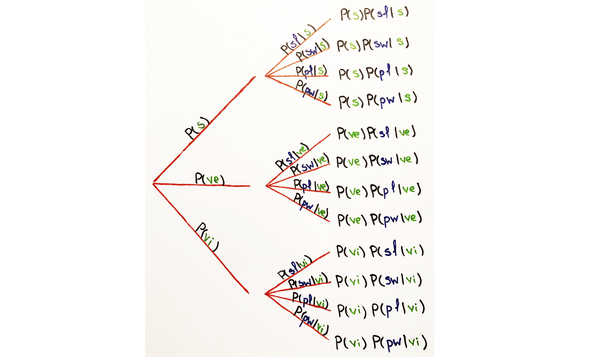
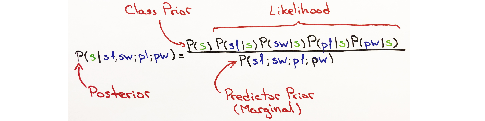

# Gauss Naive Bayes From Scratch

Building a Naive Bayes classifier using Python with drawings.

We will translate each part of the Gauss Naive Bayes into Python code and explain the logic behind its methods.

The [Complete Code](#complete-code) could be found at the bottom of this page or in [nb_tutorial.py](https://github.com/odubno/naive_bayes/blob/master/nb_tutorial.py)


# Table of Contents
  - [Overview](#overview)
    - [Iris Data Set](#iris-data-set)
    - [Bayes Theorem](#bayes-theorem)
    - [Normal Probability Density Function](#normal-pdf-formula)
  - [Prepare Data](#prepare-data)
    - [Prerequisites](#prerequisites)
    - [Load CSV](#load-csv)
    - [Split Data](#split-data)
    - [Group Data](#group-data)
  - [Summarize Data](#summarize-data)
    - [Mean](#mean)
    - [Standard Deviation](#standard-deviation)
    - [Summary](#summary)
  - [Build Model](#build-model)
    - [Prior Probability](#prior-probability)
    - [Train](#train)
    - [Likelihood](#likelihood)
    - [Joint Probability](#joint-probability)
    - [Marginal Probability](#marginal-probability)
    - [Posterior Probability](#posterior-probability)
  - [Test Model](#test-model)
    - [Get Maximum A Posterior](#get-maximum-a-posterior)
    - [Predict](#predict)
    - [Accuracy](#accuracy)
  - [Recap](#recap)
  - [Authors](#authors)
  - [Acknowledgments](#acknowledgments)
  - [Complete Code](#complete-code)
      
# Overview 
Using Naive Bayes and the Gaussian Distribution (Normal Distribution) to build a classifier 
that will predict flower species based off of petal and sepal features.

We will be working with the [iris](http://archive.ics.uci.edu/ml/machine-learning-databases/iris/iris.data) data set,
a collection of 4 dimensional features that define 3 different types of flower species.

## Iris Data Set:

The Iris data set is a classic and is widely used when explaining classification models. 
The data set has 4 independent variables and 1 dependent variable that have 3 different classes with 150 instances.

The first 4 columns are the independent variables (features).                                      
The 5th column is the dependent variable (class).

1. *sepal length* (cm)
2. *sepal width* (cm) 
3. *petal length* (cm) 
4. *petal width* (cm) 
5. class: 
    * *Iris Setosa*, 
    * *Iris Versicolour*
    * *Iris Virginica*

#### Random 5 Row Sample

| sepal length  | sepal width | petal length | petal width | class |
| :-----------: |:-----------:| :----------: | :----------:| :----:|
| 5.1 | 3.5 | 1.4 | 0.2| Iris-setosa | 
| 4.9 | 3.0 | 1.4 | 0.2| Iris-setosa |
| 7.0 | 3.2 | 4.7 | 1.4| Iris-versicolor |
| 6.3 | 2.8 | 5.1 | 1.5| Iris-virginica |
| 6.4 | 3.2 | 4.5 | 1.5| Iris-versicolor |

## Bayes Theorem:

Naive Bayes, more technically referred to as the Posterior Probability, updates the prior belief of an event given new information. 
The classification model could handle binary and multiple classifications. 

To predict a class we only care about the Maximum A Posterior probability. 
The model calculates the the posterior probability for all classes and MAP is the selection of the highest posterior probability.


*drawn by Oleh Dubno*

**Posterior Probability:**
* This is the updated belief given the new data, and the objective probability of each class, derived from the Naive Bayes technique.

**Class Prior Probability:** 
* This is the Prior Belief; the probability of the class before updating the belief.

**Likelihood:**
* Likelihood is calculated by taking the product of all [Normal Probability Density Functions](#normal-pdf) (assume independence, ergo the "Naivete"). 
The Normal PDF is calculated using the Gaussian Distribution. Hence, the name Gauss Naive Bayes. 
  - We will use the Normal PDF to calculate the Normal Probability value for each feature given the class. 
  - Likelihood is the product of all Normal PDFs.
* There's an important distinction to keep in mind between Likelihood and Probability. 
  - Normal Probability is calculated for each feature given the class and is always between 0 and 1. 
  - Likelihood is the product of all Normal Probability values. 
  - The number of features is infinite and limited to our imagination. 
  - Since there will always be features that could be added, the product of all Normal Probabilities is not the probability but the Likelihood.

**Predictor Prior Probability:**
* Predictor Prior Probability is another way of saying Marginal Probability. 
* It is the probability given the new data under all possible features for each class. 
* It isn't necessary for the Naive Bayes Classifier to calculate this, 
because we're only looking for the prediction and not the exact probability. 
* The results do not change or change very little. Though we do calculate it here.


## Normal PDF Formula:


See [Normal Distribution (Wikipedia)](https://en.wikipedia.org/wiki/Normal_distribution) definition.

The Normal Distribution will help determine the Normal Probability for each new feature given the class. 
The product of all Normal Probabilities will result in the likelihood of the *class* occurring given the new features. 
In other words, the Normal Distribution will calculate the Normal Probability value for each new feature.
The product of all Normal Probabilities will be the likelihood.

# Prepare Data

Building the Naive Bayes Classifier. 

Here, we'll create the structure and the methods to read and prepare data for modeling.

1. [Prerequisites](#prerequisites)
2. [Skeleton](#skeleton)
3. [Load CSV](#load-csv)
4. [Split Data](#split-data)
5. [Group Data](#group-data)

## Prerequisites

Every function is created from scratch.
However, instead of having to download the data, we're using an API call to get the data.

```
$ pip install requests
```

In some sections you'll see "Click to expand". Click it to view the Python code.

## Skeleton
Import the necessary libraries and create the GaussNB class. This will be the foundation for the rest of the code.

<details>
  <summary>Click to expand GaussNB Skeleton.</summary>

```python
# -*- coding: utf-8 -*-
from collections import defaultdict
from math import pi
from math import e
import requests
import random
import csv
import re

class GaussNB:

    def __init__(self):
        pass
        
        
def main():
    print "Here we will handle class methods."
    
    
if __name__ == '__main__':
    main()
```
###### Execute in terminal:
```
$ python nb_tutorial.py
```

###### Output:
```
Here we will handle class methods.
```

</details>

## Load CSV

Read in the raw data and convert each string into an integer.

<details>
  <summary>Click to expand load_csv().</summary>

```python
class GaussNB:

    def __init__(self):
        pass
        
    def load_csv(self, data, header=False):
        """
        :param data: raw comma seperated file
        :param header: remove header if it exists
        :return:
        Load and convert each string of data into a float
        """
        lines = csv.reader(data.splitlines())
        dataset = list(lines)
        if header:
            # remove header
            dataset = dataset[1:]
        for i in range(len(dataset))
            dataset[i] = [float(x) if re.search('\d', x) else x for x in dataset[i]]
        return dataset
        
def main():
    nb = GaussNB()
    url = 'http://archive.ics.uci.edu/ml/machine-learning-databases/iris/iris.data'
    data = requests.get(url).content
    data = nb.load_csv(data, header=True)
    print data[:3] # first 3 rows
    
    
if __name__ == '__main__':
    main()
```

###### Execute in terminal:
```
$ python nb_tutorial.py
```

###### Output:
```
[[4.9, 3.0, 1.4, 0.2, 'Iris-setosa'], [4.7, 3.2, 1.3, 0.2, 'Iris-setosa'], [4.6, 3.1, 1.5, 0.2, 'Iris-setosa']]
```

</details>

## Split Data
Split the data into a `train_set` and a `test_set`.

The weight will determine how much of the data will be in the `train_set`.

<details>
  <summary>Click to expand split_data().</summary>

```python
class GaussNB:
    .
    .
    .
    def split_data(self, data, weight):
        """
        :param data:
        :param weight: indicates the percentage of rows that'll be used for training
        :return:
        Randomly selects rows for training according to the weight and uses the rest of the rows for testing.
        """
        train_size = int(len(data) * weight)
        train_set = []
        for i in range(train_size):
            index = random.randrange(len(data))
            train_set.append(data[index])
            data.pop(index)
        return [train_set, data]


def main():
    nb = GaussNB()
    url = 'http://archive.ics.uci.edu/ml/machine-learning-databases/iris/iris.data'
    data = requests.get(url).content
    data = nb.load_csv(data, header=True)
    train_list, test_list = nb.split_data(data, weight=.67)
    print "Using %s rows for training and %s rows for testing" % (len(train_list), len(test_list))

if __name__ == '__main__':
    main()
```

###### Execute in terminal:
```
$ python nb_tutorial.py
```

###### Output:
```
Using 100 rows for training and 50 rows for testing
```

</details>

## Group Data

Group the data according to class by mapping each class to individual instances.

*Take this table*

| sepal length  | sepal width | petal length | petal width | class |
| :-----------: |:-----------:| :----------: | :----------:| :----:|
| 5.1 | 3.5 | 1.4 | 0.2| Iris-setosa | 
| 4.9 | 3.0 | 1.4 | 0.2| Iris-setosa |
| 7.0 | 3.2 | 4.7 | 1.4| Iris-versicolor |
| 6.3 | 2.8 | 5.1 | 1.5| Iris-virginica |
| 6.4 | 3.2 | 4.5 | 1.5| Iris-versicolor |

*and turn it into this map*
```python
{
       'Iris-virginica': [
        [6.3, 2.8, 5.1, 1.5],
    ], 'Iris-setosa': [
        [5.1, 3.5, 1.4, 0.2],
        [4.9, 3.0, 1.4, 0.2],
    ], 'Iris-versicolor': [
        [7.0, 3.2, 4.7, 1.4],
        [6.4, 3.2, 4.5, 1.5],
    ]
}
```


<details>
  <summary>Click to expand group_by_class().</summary>
  
```python
class GaussNB:
    .
    .
    .
    def group_by_class(self, data, target):
        """
        :param data: Training set. Lists of events (rows) in a list
        :param target: Index for the target column. Usually the last index in the list
        :return:
        Mapping each target to a list of it's features
        """
        target_map = defaultdict(list)
        for index in range(len(data)):
            features = data[index]
            if not features:
                continue
            x = features[target]
            target_map[x].append(features[:-1])  # designating the last column as the class column
        return dict(target_map)

def main():
    nb = GaussNB()
    url = 'http://archive.ics.uci.edu/ml/machine-learning-databases/iris/iris.data'
    data = requests.get(url).content
    data = nb.load_csv(data, header=True)
    train_list, test_list = nb.split_data(data, weight=.67)
    print "Using %s rows for training and %s rows for testing" % (len(train_list), len(test_list))
    group = nb.group_by_class(data, -1)
    print "Grouped into %s classes: %s" % (len(group.keys()), group.keys())

if __name__ == '__main__':
    main()
```

###### Execute in terminal:
```
$ python nb_tutorial.py
```

###### Output:
```
Grouped into 3 classes: ['Iris-virginica', 'Iris-setosa', 'Iris-versicolor']
```

</details>

# Summarize Data

Prepare the data for modeling. Calculate the descriptive statistics that will later be used in the model.

1. [Mean](#mean)
2. [Standard Deviation](#standard-deviation)
3. [Summary](#sumamry)

## Mean

Calculate the mean for `[5.9, 3.0, 5.1, 1.8]`.

<details>
  <summary>Click to expand mean().</summary>
  
```python
class GaussNB:
    .
    . 
    . 
    def mean(self, numbers):
        """
        :param numbers: list of numbers
        :return: 
        """
        result = sum(numbers) / float(len(numbers))
        return result

def main():
    nb = GaussNB()
    print "Mean: %s" % nb.mean([5.9, 3.0, 5.1, 1.8])

if __name__ == '__main__':
    main()
```

###### Execute in terminal:
```
$ python nb_tutorial.py
```

###### Output:
```
Mean: 3.95
```

</details>

## Standard Deviation
Calculate the standard deviation for `[5.9, 3.0, 5.1, 1.8]`.

<details>
  <summary>Click to expand stdev().</summary>
  
```python
class GaussNB:
    . 
    . 
    . 
    def stdev(self, numbers):
        """
        :param numbers: list of numbers
        :return:
        Calculate the standard deviation for a list of numbers.
        """
        avg = self.mean(numbers)
        squared_diff_list = []
        for num in numbers:
            squared_diff = (num - avg) ** 2
            squared_diff_list.append(squared_diff)
        squared_diff_sum = sum(squared_diff_list)
        sample_n = float(len(numbers) - 1)
        var = squared_diff_sum / sample_n
        return var ** .5

def main():
    nb = GaussNB()
    print "Standard Deviation: %s" % nb.stdev([5.9, 3.0, 5.1, 1.8])

if __name__ == '__main__':
    main()
```

###### Execute in terminal:
```
$ python nb_tutorial.py
```

###### Output:
```
Standard Deviation: 1.88414436814
```

</details>

## Summary
Return the (mean, standard deviation) combination for each feature of the `train_set`.
The mean and the standard deviation will be used when calculating the Normal Probabiltiy values for each feature of the `test_set`.


<details>
  <summary>Click to expand summarize().</summary>
  
```python
class GaussNB:
    . 
    . 
    . 
    def summarize(self, test_set):
        """
        :param test_set: lists of features
        :return:
        Use zip to line up each feature into a single column across multiple lists.
        yield the mean and the stdev for each feature.
        """
        for feature in zip(*test_set):
            yield {
                'stdev': self.stdev(feature),
                'mean': self.mean(feature)
            }

def main():
    nb = GaussNB()
    data = [
        [5.9, 3.0, 5.1, 1.8], 
        [5.1, 3.5, 1.4, 0.2]
    ]
    print "Feature Summary: %s" % [i for i in nb.summarize(data)]

if __name__ == '__main__':
    main()
```

###### Execute in terminal:
```
$ python nb_tutorial.py
```

###### Output:
```
Feature Summary: 
[
    {'mean': 5.5, 'stdev': 0.5656854249492386}, # sepal length 
    {'mean': 3.25, 'stdev': 0.3535533905932738}, # sepal width
    {'mean': 3.25, 'stdev': 2.6162950903902256}, # petal length
    {'mean': 1.0, 'stdev': 1.1313708498984762} # petal width
]
```

</details>

# Build Model

Building the class methods for calculating [Bayes Theorem](#bayes-theorem):

1. [Prior Probability](#prior-probability)
2. [Likelihood](#likelihood)
3. [Joint Probability](#joint-probability)
4. [Marginal Probability](#marginal-probability)
5. [Posterior Probability](#posterior-probability)

*Features and Class*


*Bayes Tree Diagram*



*Using Iris-setosa as an example*



## Prior Probability


Prior Probability is what we know about each class before considering the new data. 

It's the probability of each class occurring.


<details>
  <summary>Click to expand prior_prob().</summary>
  
```python
class GaussNB:
    . 
    . 
    . 
    def prior_prob(self, group, target, data):
        """
        :return:
        The probability of each target class
        """
        total = float(len(data))
        result = len(group[target]) / total
        return result

def main():
    nb = GaussNB()
    url = 'http://archive.ics.uci.edu/ml/machine-learning-databases/iris/iris.data'
    data = requests.get(url).content
    data = nb.load_csv(data, header=True)
    train_list, test_list = nb.split_data(data, weight=.67)
    print "Using %s rows for training and %s rows for testing" % (len(train_list), len(test_list))
    group = nb.group_by_class(data, -1)  # designating the last column as the class column
    print "Grouped into %s classes: %s" % (len(group.keys()), group.keys())
    for target_class in ['Iris-virginica', 'Iris-setosa', 'Iris-versicolor']:
        prior_prob = nb.prior_prob(group, target_class, data)
        print 'P(%s): %s' % (target_class, prior_prob)

if __name__ == '__main__':
    main()
```

###### Execute in terminal:
```
$ python nb_tutorial.py
```

###### Output:
```
Using 100 rows for training and 50 rows for testing
Grouped into 3 classes: ['Iris-virginica', 'Iris-setosa', 'Iris-versicolor']
P(Iris-virginica): 0.38
P(Iris-setosa): 0.3
P(Iris-versicolor): 0.32
```

</details>

## Train

This is where we learn from the train set, by calculating the mean and the standard deviation.

Using the grouped classes, calculate the (mean, standard deviation) combination for each feature of each class. 

The calculations will later use the (mean, standard deviation) of each feature to calculate class likelihoods.

<details>
  <summary>Click to expand train().</summary>
  
```python
class GaussNB:
    . 
    . 
    . 
    def train(self, train_list, target):
        """
        :param data:
        :param target: target class
        :return:
        For each target:
            1. yield prior_prob: the probability of each class. P(class) eg P(Iris-virginica)
            2. yield summary: list of {'mean': 0.0, 'stdev': 0.0}
        """
        group = self.group_by_class(train_list, target)
        self.summaries = {}
        for target, features in group.iteritems():
            self.summaries[target] = {
                'prior_prob': self.prior_prob(group, target, train_list),
                'summary': [i for i in self.summarize(features)],
            }
        return self.summaries

def main():
    nb = GaussNB()
    url = 'http://archive.ics.uci.edu/ml/machine-learning-databases/iris/iris.data'
    data = requests.get(url).content
    data = nb.load_csv(data, header=True)
    train_list, test_list = nb.split_data(data, weight=.67)
    print "Using %s rows for training and %s rows for testing" % (len(train_list), len(test_list))
    group = nb.group_by_class(data, -1)  # designating the last column as the class column
    print "Grouped into %s classes: %s" % (len(group.keys()), group.keys())
    print nb.train(train_list, -1)

if __name__ == '__main__':
    main()
```

###### Execute in terminal:
```
$ python nb_tutorial.py
```

###### Output:
```
Using 100 rows for training and 50 rows for testing
Grouped into 3 classes: ['Iris-virginica', 'Iris-setosa', 'Iris-versicolor']
{'Iris-setosa': {'prior_prob': 0.3,
  'summary': [{'mean': 4.980000000000001, 'stdev': 0.34680810554104063}, # sepal length 
   {'mean': 3.406666666666667, 'stdev': 0.3016430104397023}, # sepal width
   {'mean': 1.496666666666667, 'stdev': 0.20254132542705236}, # petal length
   {'mean': 0.24333333333333343, 'stdev': 0.12228664272317624}]}, # petal width
 'Iris-versicolor': {'prior_prob': 0.31,
  'summary': [{'mean': 5.96774193548387, 'stdev': 0.4430102307127106},
   {'mean': 2.7903225806451615, 'stdev': 0.28560443356698495},
   {'mean': 4.303225806451613, 'stdev': 0.41990782398659987},
   {'mean': 1.3451612903225807, 'stdev': 0.17289439874755796}]},
 'Iris-virginica': {'prior_prob': 0.39,
  'summary': [{'mean': 6.679487179487178, 'stdev': 0.585877428882027},
   {'mean': 3.002564102564103, 'stdev': 0.34602036712733625},
   {'mean': 5.643589743589742, 'stdev': 0.5215336048086158},
   {'mean': 2.0487179487179477, 'stdev': 0.2927831916298213}]}}

```

</details>

## Likelihood

Likelihood is calculated by taking the product of all Normal Probabilities.


For each feature given the class we calculate the Normal Probability using the [Normal Distribution](#normal-pdf-formula).


<details>
  <summary>Click to expand normal_pdf().</summary>
  
```python
class GaussNB:
    . 
    . 
    .
    def normal_pdf(self, x, mean, stdev):
        """
        :param x: a variable
        :param mean: µ - the expected value or average from M samples
        :param stdev: σ - standard deviation
        :return: Gaussian (Normal) Density function.
        N(x; µ, σ) = (1 / 2πσ) * (e ^ (x–µ)^2/-2σ^2
        """
        variance = stdev ** 2
        exp_squared_diff = (x - mean) ** 2
        exp_power = -exp_squared_diff / (2 * variance)
        exponent = e ** exp_power
        denominator = ((2 * pi) ** .5) * stdev
        normal_prob = exponent / denominator
        return normal_prob

def main():
    nb = GaussNB()
    normal_prob = nb.normal_pdf(5, 4.98, 0.35)
    print normal_prob

if __name__ == '__main__':
    main()
```

###### Execute in terminal:
```
$ python nb_tutorial.py
```

###### Output:
```
1.13797564994
```

</details>

## Joint Probability

Joint Probability is calculated by taking the product of the Prior Probability and the Likelihood.


For each class:
- Calculate the Prior Probability.
- Use the Normal Distribution to calculate the Normal Probability of each feature. e.g. **N(x; µ, σ)**.
- Take the product of the Prior Probability and the Likelihood.
- Return one Joint Probability value for each class given the new data.

<details>
  <summary>Click to expand joint_probabilities().</summary>

```python
class GaussNB:
    . 
    . 
    .
    def joint_probabilities(self, test_row):
        """
        :param test_row: single list of features to test; new data
        :return:
        Use the normal_pdf(self, x, mean, stdev) to calculate the Normal Probability for each feature
        Take the product of all Normal Probabilities and the Prior Probability.
        """
        joint_probs = {}
        for target, features in self.summaries.iteritems():
            total_features = len(features['summary'])
            likelihood = 1
            for index in range(total_features):
                feature = test_row[index]
                mean = features['summary'][index]['mean']
                stdev = features['summary'][index]['stdev']
                normal_prob = self.normal_pdf(feature, mean, stdev)
                likelihood *= normal_prob
            prior_prob = features['prior_prob']
            joint_probs[target] = prior_prob * likelihood
        return joint_probs

def main():
    nb = GaussNB()
    url = 'http://archive.ics.uci.edu/ml/machine-learning-databases/iris/iris.data'
    data = requests.get(url).content
    data = nb.load_csv(data, header=True)
    train_list, test_list = nb.split_data(data, weight=.67)
    print "Using %s rows for training and %s rows for testing" % (len(train_list), len(test_list))
    group = nb.group_by_class(data, -1)  # designating the last column as the class column
    print "Grouped into %s classes: %s" % (len(group.keys()), group.keys())
    nb.train(train_list, -1)
    print nb.joint_probabilities([5.0, 4.98, 0.35, 4.0])

if __name__ == '__main__':
    main()
```
###### Execute in terminal:
```
$ python nb_tutorial.py
```

###### Output:
```
Using 100 rows for training and 50 rows for testing
Grouped into 3 classes: ['Iris-virginica', 'Iris-setosa', 'Iris-versicolor']
{
    'Iris-virginica': 7.880001356130214e-38, 
    'Iris-setosa': 9.616469451152855e-230, 
    'Iris-versicolor': 6.125801208117717e-68
}
```

</details>

## Marginal Probability

Calculate the total sum of all joint probabilities. 


The Marginal Probability is determined using each class and the Normal Probability of their features.
The Marginal value, a single value for each class, will be the same across all classes for each test. 
We could think of the Marginal Probability as the total joint probability of all classes occurring given the new data.
Thus, the Marginal value will be the same across all classes.

Reminder, we're looking to predict the class by choosing the Maximum A Posterior (MAP).
The prediction doesn't care about the exact posterior probability of each class and 
dividing by the same value is more memory intensive and does not improve the accuracy of predicting the correct class.

For the purposes of sticking to the true [Bayes Theorem](#bayes-theorem), we're using it here.

<details>
  <summary>Click to expand marginal_pdf().</summary>

```python
class GaussNB:
    . 
    . 
    . 
    def marginal_pdf(self, joint_probabilities):
        """
        :param joint_probabilities: list of joint probabilities for each feature
        :return:
        Marginal Probability Density Function (Predictor Prior Probability)
        Joint Probability = prior * likelihood
        Marginal Probability is the sum of all joint probabilities for all classes.

        marginal_pdf =
          [P(setosa) * P(sepal length | setosa) * P(sepal width | setosa) * P(petal length | setosa) * P(petal width | setosa)]
        + [P(versicolour) * P(sepal length | versicolour) * P(sepal width | versicolour) * P(petal length | versicolour) * P(petal width | versicolour)]
        + [P(virginica) * P(sepal length | verginica) * P(sepal width | verginica) * P(petal length | verginica) * P(petal width | verginica)]

        """
        marginal_prob = sum(joint_probabilities.values())
        return marginal_prob

def main():
    nb = GaussNB()
    joint_probs = {
        'Iris-setosa': 1.2904413965468937,
        'Iris-versicolor': 5.414630046086964e-14,
        'Iris-virginica': 7.087518912297627e-30
    }
    marginal_prob = nb.marginal_pdf(joint_probs)
    print 'Marginal Probability: %s' % marginal_prob

if __name__ == '__main__':
    main()
```

###### Execute in terminal:
```
$ python nb_tutorial.py
```

###### Output:
```
Marginal Probability: 1.29044139655
```

</details>

## Posterior Probability

The Posterior Probability is the probability of a class occuring and is calculated for each class given the new data.


This where all the preceding class methods tie together to calculate the Gauss Naive Bayes formula with the goal of selecting MAP.

<details>
  <summary>Click to expand posterior_probabilities().</summary>

```python
class GaussNB:
    .
    .
    .
    def posterior_probabilities(self, test_row):
        """
        :param test_row: single list of features to test; new data
        :return:
        For each feature (x) in the test_row:
            1. Calculate Predictor Prior Probability using the Normal PDF N(x; µ, σ). eg = P(feature | class)
            2. Calculate Likelihood by getting the product of the prior and the Normal PDFs
            3. Multiply Likelihood by the prior to calculate the Joint Probability. 

        E.g.
        prior_prob: P(setosa)
        likelihood: P(sepal length | setosa) * P(sepal width | setosa) * P(petal length | setosa) * P(petal width | setosa)
        joint_prob: prior_prob * likelihood
        marginal_prob: predictor prior probability
        posterior_prob = joint_prob/ marginal_prob

        returning a dictionary mapping of class to it's posterior probability
        """
        posterior_probs = {}
        joint_probabilities = self.joint_probabilities(test_row)
        marginal_prob = self.marginal_pdf(joint_probabilities)
        for target, joint_prob in joint_probabilities.iteritems():
            posterior_probs[target] = joint_prob / marginal_prob
        return posterior_probs

def main():
    nb = GaussNB()
    url = 'http://archive.ics.uci.edu/ml/machine-learning-databases/iris/iris.data'
    data = requests.get(url).content
    data = nb.load_csv(data, header=True)
    train_list, test_list = nb.split_data(data, weight=.67)
    print "Using %s rows for training and %s rows for testing" % (len(train_list), len(test_list))
    group = nb.group_by_class(data, -1)  # designating the last column as the class column
    print "Grouped into %s classes: %s" % (len(group.keys()), group.keys())
    nb.train(train_list, -1)
    posterior_probs = nb.posterior_probabilities([6.3, 2.8, 5.1, 1.5])
    print "Posterior Probabilityies: %s" % posterior_probs

if __name__ == '__main__':
    main()
```

###### Execute in terminal:
```
$ python nb_tutorial.py
```

###### Output:
```
Using 100 rows for training and 50 rows for testing
Grouped into 3 classes: ['Iris-virginica', 'Iris-setosa', 'Iris-versicolor']
Posterior Probabilityies: {
    'Iris-virginica': 0.32379024365947745,
    'Iris-setosa': 2.5693999408505845e-158,
    'Iris-versicolor': 0.6762097563405226
}
```

</details>

# Test Model

1. [Get Prediction](#get-prediction)
2. [Predict](#predict)
3. [Accuracy](#accuracy)

## Get Maximum A Posterior

This is where the prediction happens. `get_map()` method will call the `posterior_probabilities()` method on a single `test_row` eg (`[6.3, 2.8, 5.1, 1.5]`). 

For each `test_row` we will calculate 3 Posterior Probabilities; one for each class. The goal is to select MAP, the Maximum A Posterior probability.

The `get_map()` method will simply choose the Maximum A Posterior Probability and return the associated class for the given `test_row`.

<details>
  <summary>Click to expand get_map().</summary>

```python
class GaussNB:
    .
    . 
    . 
    def get_map(self, test_row):
        """
        :param test_row: single list of features to test
        :return:
        Return the target class with the largest/best posterior probability
        """
        posterior_probs = self.posterior_probabilities(test_row)
        map_prob = max(posterior_probs, key=posterior_probs.get)
        return map_prob

def main():
    nb = GaussNB()
    url = 'http://archive.ics.uci.edu/ml/machine-learning-databases/iris/iris.data'
    data = requests.get(url).content
    data = nb.load_csv(data, header=True)
    train_list, test_list = nb.split_data(data, weight=.67)
    print "Using %s rows for training and %s rows for testing" % (len(train_list), len(test_list))
    group = nb.group_by_class(data, -1)  # designating the last column as the class column
    print "Grouped into %s classes: %s" % (len(group.keys()), group.keys())
    nb.train(train_list, -1)
    prediction = nb.get_map([6.3, 2.8, 5.1, 1.5])  # 'Iris-virginica'
    print 'According to the test row the best prediction is: %s' % prediction

if __name__ == '__main__':
    main()
```

###### Execute in terminal:
```
$ python nb_tutorial.py
```

###### Output:
```
Using 100 rows for training and 50 rows for testing
Grouped into 3 classes: ['Iris-virginica', 'Iris-setosa', 'Iris-versicolor']
According to the test row the best prediction is: Iris-versicolor
```

</details>

## Predict

This method will return a prediction for each test_row.

Example input, list of lists: 
```
[
    [5.1, 3.5, 1.4, 0.2],
    [4.9, 3.0, 1.4, 0.2],
]
```
For testing this method, we'll use the data from the [sample data](#group-data) above.

<details>
  <summary>Click to expand predict().</summary>

```python
class GaussNB:
    .
    . 
    .
    def predict(self, test_set):
        """
        :param test_set: list of features to test on
        :return:
        Predict the likeliest target for each row of the test_set.
        Return a list of predicted targets.
        """
        map_probs = []
        for row in test_set:
            map_prob = self.get_map(row)
            map_probs.append(map_prob)
        return map_probs

def main():
    nb = GaussNB()
    url = 'http://archive.ics.uci.edu/ml/machine-learning-databases/iris/iris.data'
    data = requests.get(url).content
    data = nb.load_csv(data, header=True)
    train_list, test_list = nb.split_data(data, weight=.67)
    print "Using %s rows for training and %s rows for testing" % (len(train_list), len(test_list))
    group = nb.group_by_class(data, -1)  # designating the last column as the class column
    print "Grouped into %s classes: %s" % (len(group.keys()), group.keys())
    nb.train(train_list, -1)
    test = {
           'Iris-virginica': [
            [6.3, 2.8, 5.1, 1.5],
        ], 'Iris-setosa': [
            [5.1, 3.5, 1.4, 0.2],
            [4.9, 3.0, 1.4, 0.2],
        ], 'Iris-versicolor': [
            [7.0, 3.2, 4.7, 1.4],
            [6.4, 3.2, 4.5, 1.5],
        ]
    }
    for target, features in test.iteritems():
        predicted = nb.predict(features)
        print 'predicted target: %s | true target: %s' % (predicted, target)

if __name__ == '__main__':
    main()
```

###### Execute in terminal:
```
$ python nb_tutorial.py
```

###### Output: 
```
Using 100 rows for training and 50 rows for testing
Grouped into 3 classes: ['Iris-virginica', 'Iris-setosa', 'Iris-versicolor']
predicted target: ['Iris-versicolor'] | true target: Iris-virginica
predicted target: ['Iris-setosa', 'Iris-setosa'] | true target: Iris-setosa # both test rows were predicted to be setosa
predicted target: ['Iris-versicolor', 'Iris-versicolor'] | true target: Iris-versicolor # both test rows were predicted to be versicolor
```

</details>

## Accuracy
Accuracy will test the performance of the model by taking the total of correct predictions and dividing them by the total of predictions.

<details>
  <summary>Click to expand accuracy().</summary>
  
```python
class GaussNB:
    .
    . 
    . 
    def accuracy(self, test_set, predicted):
        """
        :param test_set: list of test_data
        :param predicted: list of predicted classes
        :return:
        Calculate the the average performance of the classifier.
        """
        correct = 0
        actual = [item[-1] for item in test_set]
        for x, y in zip(actual, predicted):
            if x == y:
                correct += 1
        return correct / float(len(test_set))

def main():
    nb = GaussNB()
    url = 'http://archive.ics.uci.edu/ml/machine-learning-databases/iris/iris.data'
    data = requests.get(url).content
    data = nb.load_csv(data, header=True)
    train_list, test_list = nb.split_data(data, weight=.67)
    print "Using %s rows for training and %s rows for testing" % (len(train_list), len(test_list))
    group = nb.group_by_class(data, -1)  # designating the last column as the class column
    print "Grouped into %s classes: %s" % (len(group.keys()), group.keys())
    nb.train(train_list, -1)
    predicted = nb.predict(test_list)
    accuracy = nb.accuracy(test_list, predicted)
    print 'Accuracy: %.3f' % accuracy

if __name__ == '__main__':
    main()
```

###### Execute in terminal:
```
$ python nb_tutorial.py
```

###### Output: 
```
Using 100 rows for training and 50 rows for testing
Grouped into 3 classes: ['Iris-virginica', 'Iris-setosa', 'Iris-versicolor']
Accuracy: 0.960
```

</details>

## Recap

The Naive Bayes Classification model makes some strong assumptions. All of the features are assumed to be independent when calculating the likelihood; hence "Naive".
Likelihood is calculated using the Gaussian Distribution (Normal Distribution) and all of the features are assumed to be normally distribtuted; hence "Gauss". 

Overlooking Gauss NB's **strong assumptions**, the classifier is very fast and accurate. 
Gauss NB does not require a lot of data to be accurate and is highly scalable.

You could find the [Complete Code](#complete-code) below.

The initial build of Gauss Naive Bayes classifier could run on the four classic data sets:

* [iris](http://archive.ics.uci.edu/ml/machine-learning-databases/iris/iris.data)
* [diabetes](https://archive.ics.uci.edu/ml/machine-learning-databases/pima-indians-diabetes/pima-indians-diabetes.data)
* [redwine](http://archive.ics.ucimachine-learning-databases/wine-quality/winequality-red.csv)
* [adult](http://archive.ics.uci.edu/ml/machine-learning-databases/adult/adult.data)

You could find that code in [gauss_nb.py](https://github.com/odubno/naive_bayes/blob/master/gauss_nb.py)

# Authors

* **Oleh Dubno** - [github.odubno](http://odubno.github.io/)
  - Code and images.
* **Danny Argov** - [github.datargov](http://github.com/datargov/)
  - Wording and logic of text. 

See the list of [contributors](https://github.com/odubno/naive_bayes/graphs/contributors) who participated in this project.


# Acknowledgments

A hat tip to the authors that made this tutorial possible.

| Author                  | URL           |
| -------------           |:-------------|
| Dr. Jason Brownlee      | [How To Implement Naive Bayes From Scratch in Python](https://machinelearningmastery.com/naive-bayes-classifier-scratch-python/) |
| Chris Albon             | [Naive Bayes Classifier From Scratch](https://chrisalbon.com/machine-learning/naive_bayes_classifier_from_scratch.html) |
| Sunil Ray               | [6 Easy Steps to Learn Naive Bayes Algorithm](https://www.analyticsvidhya.com/blog/2017/09/naive-bayes-explained/) |
| Rahul Saxena            | [How The Naive Bayes Classifier Works In Machine Learning](http://dataaspirant.com/2017/02/06/naive-bayes-classifier-machine-learning/) |
| Data Source             | [UCI Machine Learning](http://archive.ics.uci.edu/ml/index.php) |
| C. Randy Gallistel      | [Bayes for Beginners: Probability and Likelihood](https://www.psychologicalscience.org/observer/bayes-for-beginners-probability-and-likelihood) |

# Inspiration:  
Project for Columbia University Probability and Statistics course - Prof. Banu Baydil

# Complete Code

Code is also available in [nb_tutorial.py](https://github.com/odubno/naive_bayes/blob/master/nb_tutorial.py).

<details>
  <summary>Click to expand nb_tutorial.py</summary>
  
```python
# -*- coding: utf-8 -*-
from collections import defaultdict
from math import pi
from math import e
import requests
import random
import csv
import re


class GaussNB:
    def __init__(self):
        pass

    def load_csv(self, data, header=False):
        """
        :param data: raw comma seperated file
        :param header: remove header if it exists
        :return:
        Load and convert each string of data into a float
        """
        lines = csv.reader(data.splitlines())
        dataset = list(lines)
        if header:
            # remove header
            dataset = dataset[1:]
        for i in range(len(dataset)):
            dataset[i] = [float(x) if re.search('\d', x) else x for x in dataset[i]]
        return dataset

    def split_data(self, data, weight):
        """
        :param data:
        :param weight: indicates the percentage of rows that'll be used for training
        :return:
        Randomly selects rows for training according to the weight and uses the rest of the rows for testing.
        """
        train_size = int(len(data) * weight)
        train_set = []
        for i in range(train_size):
            index = random.randrange(len(data))
            train_set.append(data[index])
            data.pop(index)
        return [train_set, data]

    def group_by_class(self, data, target):
        """
        :param data: Training set. Lists of events (rows) in a list
        :param target: Index for the target column. Usually the last index in the list
        :return:
        Mapping each target to a list of it's features
        """
        target_map = defaultdict(list)
        for index in range(len(data)):
            features = data[index]
            if not features:
                continue
            x = features[target]
            target_map[x].append(features[:-1])
        return dict(target_map)

    def mean(self, numbers):
        """
        :param numbers: list of numbers
        :return:
        """
        result = sum(numbers) / float(len(numbers))
        return result

    def stdev(self, numbers):
        """
        :param numbers: list of numbers
        :return:
        Calculate the standard deviation for a list of numbers.
        """
        avg = self.mean(numbers)
        squared_diff_list = []
        for num in numbers:
            squared_diff = (num - avg) ** 2
            squared_diff_list.append(squared_diff)
        squared_diff_sum = sum(squared_diff_list)
        sample_n = float(len(numbers) - 1)
        var = squared_diff_sum / sample_n
        return var ** .5

    def summarize(self, test_set):
        """
        :param test_set: lists of features
        :return:
        Use zip to line up each feature into a single column across multiple lists.
        yield the mean and the stdev for each feature.
        """
        for feature in zip(*test_set):
            yield {
                'stdev': self.stdev(feature),
                'mean': self.mean(feature)
            }

    def prior_prob(self, group, target, data):
        """
        :return:
        The probability of each target class
        """
        total = float(len(data))
        result = len(group[target]) / total
        return result

    def train(self, train_list, target):
        """
        :param data:
        :param target: target class
        :return:
        For each target:
            1. yield prior_prob: the probability of each class. P(class) eg P(Iris-virginica)
            2. yield summary: list of {'mean': 0.0, 'stdev': 0.0}
        """
        group = self.group_by_class(train_list, target)
        self.summaries = {}
        for target, features in group.iteritems():
            self.summaries[target] = {
                'prior_prob': self.prior_prob(group, target, train_list),
                'summary': [i for i in self.summarize(features)],
            }
        return self.summaries

    def normal_pdf(self, x, mean, stdev):
        """
        :param x: a variable
        :param mean: µ - the expected value or average from M samples
        :param stdev: σ - standard deviation
        :return: Gaussian (Normal) Density function.
        N(x; µ, σ) = (1 / 2πσ) * (e ^ (x–µ)^2/-2σ^2
        """
        variance = stdev ** 2
        exp_squared_diff = (x - mean) ** 2
        exp_power = -exp_squared_diff / (2 * variance)
        exponent = e ** exp_power
        denominator = ((2 * pi) ** .5) * stdev
        normal_prob = exponent / denominator
        return normal_prob

    def marginal_pdf(self, joint_probabilities):
        """
        :param joint_probabilities: list of joint probabilities for each feature
        :return:
        Marginal Probability Density Function (Predictor Prior Probability)
        Joint Probability = prior * likelihood
        Marginal Probability is the sum of all joint probabilities for all classes.

        marginal_pdf =
          [P(setosa) * P(sepal length | setosa) * P(sepal width | setosa) * P(petal length | setosa) * P(petal width | setosa)]
        + [P(versicolour) * P(sepal length | versicolour) * P(sepal width | versicolour) * P(petal length | versicolour) * P(petal width | versicolour)]
        + [P(virginica) * P(sepal length | verginica) * P(sepal width | verginica) * P(petal length | verginica) * P(petal width | verginica)]

        """
        marginal_prob = sum(joint_probabilities.values())
        return marginal_prob

    def joint_probabilities(self, test_row):
        """
        :param test_row: single list of features to test; new data
        :return:
        Use the normal_pdf(self, x, mean, stdev) to calculate the Normal Probability for each feature
        Take the product of all Normal Probabilities and the Prior Probability.
        """
        joint_probs = {}
        for target, features in self.summaries.iteritems():
            total_features = len(features['summary'])
            likelihood = 1
            for index in range(total_features):
                feature = test_row[index]
                mean = features['summary'][index]['mean']
                stdev = features['summary'][index]['stdev']
                normal_prob = self.normal_pdf(feature, mean, stdev)
                likelihood *= normal_prob
            prior_prob = features['prior_prob']
            joint_probs[target] = prior_prob * likelihood
        return joint_probs

    def posterior_probabilities(self, test_row):
        """
        :param test_row: single list of features to test; new data
        :return:
        For each feature (x) in the test_row:
            1. Calculate Predictor Prior Probability using the Normal PDF N(x; µ, σ). eg = P(feature | class)
            2. Calculate Likelihood by getting the product of the prior and the Normal PDFs
            3. Multiply Likelihood by the prior to calculate the Joint Probability.

        E.g.
        prior_prob: P(setosa)
        likelihood: P(sepal length | setosa) * P(sepal width | setosa) * P(petal length | setosa) * P(petal width | setosa)
        joint_prob: prior_prob * likelihood
        marginal_prob: predictor prior probability
        posterior_prob = joint_prob/ marginal_prob

        returning a dictionary mapping of class to it's posterior probability
        """
        posterior_probs = {}
        joint_probabilities = self.joint_probabilities(test_row)
        marginal_prob = self.marginal_pdf(joint_probabilities)
        for target, joint_prob in joint_probabilities.iteritems():
            posterior_probs[target] = joint_prob / marginal_prob
        return posterior_probs

    def get_map(self, test_row):
        """
        :param test_row: single list of features to test; new data
        :return:
        Return the target class with the largest/best posterior probability
        """
        posterior_probs = self.posterior_probabilities(test_row)
        map = max(posterior_probs, key=posterior_probs.get)
        return map

    def predict(self, test_set):
        """
        :param test_set: list of features to test on
        :return:
        Predict the likeliest target for each row of the test_set.
        Return a list of predicted targets.
        """
        predictions = []
        for row in test_set:
            result = self.get_map(row)
            predictions.append(result)
        return predictions

    def accuracy(self, test_set, predicted):
        """
        :param test_set: list of test_data
        :param predicted: list of predicted classes
        :return:
        Calculate the the average performance of the classifier.
        """
        correct = 0
        actual = [item[-1] for item in test_set]
        for x, y in zip(actual, predicted):
            if x == y:
                correct += 1
        return correct / float(len(test_set))

def main():
    nb = GaussNB()
    url = 'http://archive.ics.uci.edu/ml/machine-learning-databases/iris/iris.data'
    data = requests.get(url).content
    data = nb.load_csv(data, header=True)
    train_list, test_list = nb.split_data(data, weight=.67)
    print "Using %s rows for training and %s rows for testing" % (len(train_list), len(test_list))
    group = nb.group_by_class(data, -1)  # designating the last column as the class column
    print "Grouped into %s classes: %s" % (len(group.keys()), group.keys())
    nb.train(train_list, -1)
    predicted = nb.predict(test_list)
    accuracy = nb.accuracy(test_list, predicted)
    print 'Accuracy: %.3f' % accuracy

if __name__ == '__main__':
    main()
```

</details>
